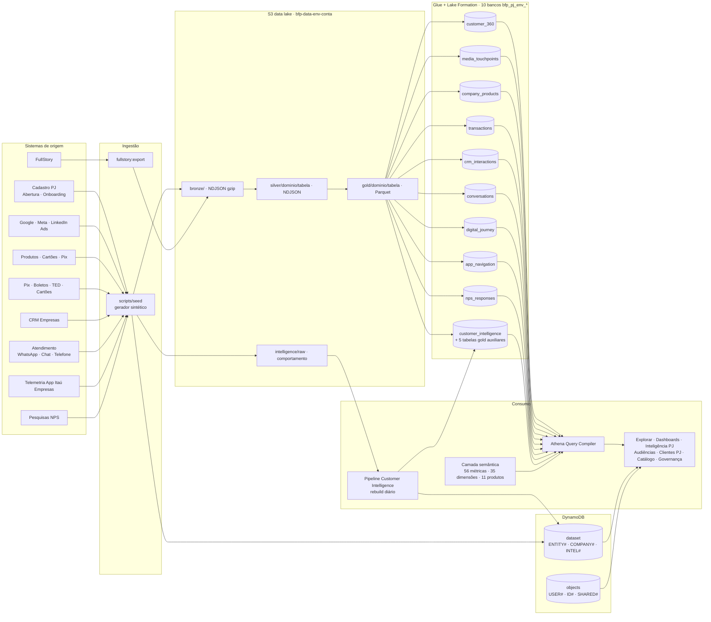
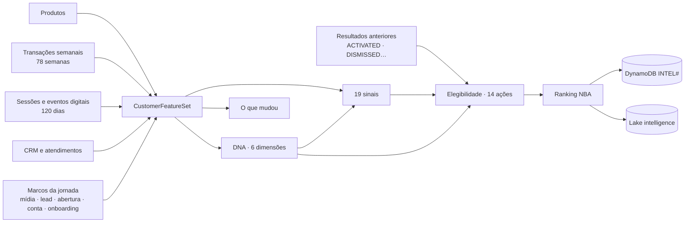
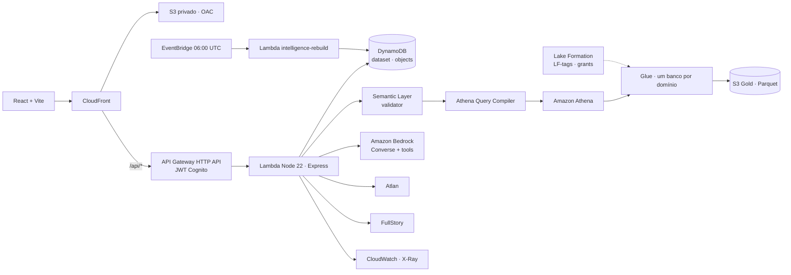

# BFP - PJ · Business Friendly Platform

> Todos os dados PJ em um só lugar, prontos para explorar, combinar e analisar.

O produto é um **playground analítico governado**: o negócio monta as próprias análises
combinando **métricas + dimensões + filtros + período + visualização**. Dashboards, audiências,
a Inteligência PJ e a página Cliente PJ são consequências da exploração — todos operam sobre o
mesmo contrato, `AnalysisSpec`, e sobre o mesmo catálogo semântico.

```
EXPLORAR → ANALISAR → SALVAR → ORGANIZAR EM DASHBOARD → COMPARTILHAR → CRIAR AUDIÊNCIA → ATIVAR
CLIENTE PJ: DADOS → FEATURES → SINAIS → DNA → AÇÕES CANDIDATAS → ELEGIBILIDADE → RANKING → NBA → RESULTADO
```

## Sumário

1. [Mapa de dados](#mapa-de-dados)
2. [Arquitetura](#arquitetura)
3. [Documentação do código](#documentação-do-código)
4. [Execução local](#execução-local)
5. [Testes](#testes)
6. [Deploy na AWS](#deploy-na-aws)
7. [Variáveis de ambiente](#variáveis-de-ambiente-api)
8. [Documentação detalhada](#documentação-detalhada)

---

## Mapa de dados

Todos os dados são **sintéticos e determinísticos** (LGPD): nenhum CNPJ real, nome real ou
texto livre. Os domínios reais devem publicar nas mesmas tabelas e colunas — o contrato está em
`packages/semantic-layer/src/mesh.ts`.

### Visão geral do fluxo



### Produtos de dados do mesh (Glue `bfp_pj_<env>_<banco>`)

Todas as tabelas se ligam por **`company_id`**. Só `customer_360` carrega atributos da empresa
(porte, segmento, região…); as demais trazem a chave e o motor faz o JOIN quando a análise pede.

| Produto (tabela)        | Banco Glue     | Origem                                        | Grão                     | Owner                       | Linhas (dev) |
| ----------------------- | -------------- | --------------------------------------------- | ------------------------ | --------------------------- | -----------: |
| `customer_360`          | `customer360`  | Cadastro PJ · Abertura de contas · Onboarding | 1 por empresa            | Clientes PJ                 |       22.447 |
| `media_touchpoints`     | `media`        | Google Ads · Meta Ads · LinkedIn Ads          | 1 por touchpoint         | Mídia PJ                    |       60.000 |
| `company_products`      | `products`     | Produtos PJ · Cartões PJ · Pix PJ             | 1 por produto contratado | Produtos PJ                 |        7.996 |
| `transactions`          | `payments`     | Pix · Boletos · TED · Cartões PJ              | 1 por transação          | Pagamentos PJ               |       45.000 |
| `crm_interactions`      | `relationship` | CRM Empresas                                  | 1 por interação          | Relacionamento PJ           |       12.000 |
| `conversations`         | `service`      | WhatsApp · Chat · Telefone                    | 1 por conversa           | Atendimento PJ              |        8.000 |
| `digital_journey`       | `digital`      | **FullStory**                                 | 1 por evento digital     | Canais Digitais PJ          |       80.000 |
| `app_navigation`        | `app`          | Telemetria do App Itaú Empresas               | 1 por interação no app   | Canais Digitais PJ          |       90.000 |
| `nps_responses`         | `experience`   | Pesquisas de satisfação (NPS)                 | 1 por resposta           | Experiência do Cliente PJ   |        5.000 |
| `customer_intelligence` | `intelligence` | Pipeline Customer Intelligence (DNA + NBA)    | 1 por empresa e cálculo  | Inteligência de Clientes PJ |       22.447 |

### Colunas, métricas e dimensões por produto

| Produto                 | Colunas principais                                                                                                                                                                               | Métricas certificadas                                                                                                                                                                                                                                   | Dimensões                                                                                                                                                                                                 |
| ----------------------- | ------------------------------------------------------------------------------------------------------------------------------------------------------------------------------------------------ | ------------------------------------------------------------------------------------------------------------------------------------------------------------------------------------------------------------------------------------------------------- | --------------------------------------------------------------------------------------------------------------------------------------------------------------------------------------------------------- |
| `customer_360`          | segment, industry, company_size, state, region, acquisition_source/channel/campaign_id, company_status, lead/opening/account/onboarding/activation dates, lgpd_consent                           | companies_total, new_companies, leads, accounts_opened, converted_leads, account_conversion_rate, cac, onboarding_started/completed, onboarding_completion_rate, activation_d30(_rate), active_companies, average_opening_time, average_onboarding_time | segment, industry, company_size, state, region, acquisition_source, acquisition_channel, acquisition_campaign, company_status, lead_date, account_opened_date, onboarding_completed_date, activation_date |
| `media_touchpoints`     | touchpoint_id, campaign_id, channel, campaign_objective, touchpoint_type, occurred_at, cost, impressions, clicks                                                                                 | media_spend, impressions, clicks, ctr, cpl, campaign_conversion_rate                                                                                                                                                                                    | touchpoint_date, campaign_channel, campaign_objective                                                                                                                                                     |
| `company_products`      | company_product_id, product_name, product_category, status, contracted_at, monthly_revenue_proxy                                                                                                 | products_per_company, revenue_proxy                                                                                                                                                                                                                     | product, product_category, contracted_date                                                                                                                                                                |
| `transactions`          | transaction_id, transaction_type, channel, amount, occurred_at                                                                                                                                   | transaction_volume, transactions_count, average_ticket, pix_volume, boletos_issued, transacting_companies                                                                                                                                               | transaction_type, transaction_channel, transaction_date                                                                                                                                                   |
| `crm_interactions`      | interaction_id, interaction_type, direction, outcome, occurred_at                                                                                                                                | crm_interactions_total, crm_contacted_companies                                                                                                                                                                                                         | crm_interaction_type, crm_outcome                                                                                                                                                                         |
| `conversations`         | conversation_id, channel, status, started_at, resolved_at                                                                                                                                        | conversations_total, conversations_resolved, unresolved_conversations, conversation_resolution_rate                                                                                                                                                     | conversation_status, conversation_channel                                                                                                                                                                 |
| `digital_journey`       | event_id, session_id, event_type, event_name, page_url, channel, occurred_at                                                                                                                     | digital_sessions, digital_active_companies                                                                                                                                                                                                              | (atributos da empresa via customer_360)                                                                                                                                                                   |
| `app_navigation`        | event_id, session_id, screen, action, platform, app_version, duration_seconds, occurred_at                                                                                                       | app_interactions, app_sessions, app_active_companies, app_avg_screen_time, app_errors, app_error_rate, app_completions, app_completion_rate, app_abandons                                                                                               | app_screen, app_action, app_platform, app_event_date                                                                                                                                                      |
| `nps_responses`         | response_id, touchpoint, score, responded_at                                                                                                                                                     | nps_responses, nps                                                                                                                                                                                                                                      | nps_touchpoint, nps_date                                                                                                                                                                                  |
| `customer_intelligence` | snapshot_id, calculated_at, nba_action, nba_score, nba_confidence, primary_signal, signal_count, dna_* (6 scores), commercial_intent_level, digital_engagement_level, dna_version, model_version | intelligence_customers, avg_nba_score, dna_digital_engagement_score, dna_product_depth_score, dna_relationship_strength_score, dna_commercial_intent_score, dna_business_momentum_score, dna_transaction_activity_score                                 | nba_action, dna_commercial_intent_level, dna_digital_engagement_level                                                                                                                                     |

Tabelas gold auxiliares da inteligência (mesmo banco `intelligence`, publicadas por
`seed:intelligence`): `customer_features` (22.447), `customer_dna` (134.682, formato longo),
`customer_signals` (37.220), `nba_recommendations` (58.558) e `nba_outcomes`.

### Customer Intelligence: do dado bruto à recomendação



| Dado bruto (por cliente)                                                 | Origem lógica                    | Alimenta (features → DNA)                                                                                               |
| ------------------------------------------------------------------------ | -------------------------------- | ----------------------------------------------------------------------------------------------------------------------- |
| Produtos contratados e uso                                               | Produtos PJ / `company_products` | products_count, active_products_ratio, relevant_gaps → **Profundidade de produtos**                                     |
| Transações semanais (entradas, saídas, Pix, boletos, cartão, pagamentos) | Pagamentos                       | volume e variação 30/60 dias, meios usados → **Atividade transacional**, **Momentum**                                   |
| Sessões digitais (app/IB) e eventos (login, páginas, buscas, simulações) | FullStory / telemetria do app    | logins, dias ativos, funcionalidades, conteúdo de crédito, simulações → **Engajamento digital**, **Intenção comercial** |
| Interações de CRM e atendimentos                                         | CRM Empresas / Atendimento       | contatos 90 dias, recência, pendências, reclamações → **Relacionamento**, penalidades                                   |
| Marcos da jornada                                                        | Cadastro / Abertura / Onboarding | tempo de relacionamento, onboarding, abertura pendente (prospects)                                                      |
| Resultados de recomendações                                              | Plataforma (botões da página)    | cooldown e feedback do modelo                                                                                           |

Cobertura: **22.447 empresas** = 5.004 com conta + 17.443 prospects (leads e aberturas em
andamento). Detalhes em [docs/synthetic-data.md](docs/synthetic-data.md).

### Armazenamento operacional (DynamoDB)

| Tabela                 | Chave                                                          | Conteúdo                                                                                                                            |
| ---------------------- | -------------------------------------------------------------- | ----------------------------------------------------------------------------------------------------------------------------------- |
| `bfp-pj-<env>-dataset` | `PK = ENTITY#<tipo>`, `GSI1PK = COMPANY#<id>`                  | entidades do dataset (empresas, contas, produtos, CRM, conversas, eventos, NPS, snapshots…) para Clientes PJ e prévias de audiência |
|                        | `PK = INTEL#PROFILE` / `INTEL#SUMMARY`, `SK = customerId`      | perfil completo da inteligência e resumo compacto (clusters e semelhantes)                                                          |
|                        | `PK = INTEL#OUTCOME#<customerId>`                              | resultados das recomendações (`ACTIVATED`, `DISMISSED`…)                                                                            |
| `bfp-pj-<env>-objects` | `PK = USER#<id>`, `GSI1PK = ID#<id>`, `GSI2PK = SHARED#<tipo>` | análises, dashboards, audiências, jobs de ativação, favoritos, conversas e estudos da IA, preferências                              |

### Layout do bucket do lake

| Prefixo                              | Conteúdo                                                                                                                     |
| ------------------------------------ | ---------------------------------------------------------------------------------------------------------------------------- |
| `bronze/<fonte>/`                    | NDJSON gzip por fonte (companies, media, crm, onboarding, products, conversations, fullstory) sem CNPJ, nomes ou texto livre |
| `silver/<banco>/<tabela>/`           | NDJSON normalizado (tabelas JSON do Athena `silver_<tabela>`)                                                                |
| `gold/<banco>/<tabela>/`             | Parquet (Snappy) via CTAS, documentado no Glue (owner, domínio, grão)                                                        |
| `intelligence/raw/customers.json.gz` | comportamento bruto lido pelo rebuild diário da inteligência                                                                 |
| `analytics-results/`                 | resultados das consultas do Athena                                                                                           |

### Governança do dado

- **Acesso**: Lake Formation com LF-tags por domínio; usuários de negócio não veem domínios
  restritos (ex.: mídia). A API só lê `gold/*`.
- **Qualidade e freshness**: SLO e limiar de qualidade por produto de dados
  (`DATA_PRODUCT_CATALOG`); o horário de carga fica no SSM `/bfp-pj-<env>/data-loaded-at`.
- **Catálogo oficial**: Atlan (certificação, owners, glossário); DataZone opcional.
- **Versionamento** da inteligência: `dnaVersion` e `modelVersion` em cada perfil e tabela.
- **Privacidade**: nenhum atributo pessoal sensível entra em features, DNA ou NBA.

---

## Arquitetura



| Camada      | Implementação                                                                                                                      |
| ----------- | ---------------------------------------------------------------------------------------------------------------------------------- |
| Frontend    | React 19, TypeScript, Vite, Tailwind v4 (tokens em `apps/web/src/app/styles.css`), TanStack Query, Zustand, Recharts               |
| API         | Express empacotado para Lambda (`apps/api`), Zod, RBAC, logs estruturados                                                          |
| Semântica   | `packages/semantic-layer` — 56 métricas, 35 dimensões, 11 produtos de dados, glossário, linhagem e contrato do mesh                |
| Motor       | `packages/analytics-engine` — engine local/DynamoDB, **AthenaQueryCompiler**, Insight Engine, Audience Engine                      |
| Clientes PJ | `packages/customer-intelligence` — features, Customer DNA, sinais, mudanças, elegibilidade e Próxima Melhor Ação (determinístico)  |
| IA          | Inteligência PJ: provedor determinístico local ou **Amazon Bedrock** (Converse + ferramentas governadas); a IA explica, não decide |
| Data mesh   | 10 produtos de dados (Glue + Lake Formation, DataZone opcional); o usuário escolhe as bases e o motor faz JOIN por `company_id`    |
| Integrações | **Atlan** (certificação, owners, glossário) e **FullStory** (sessões e eventos da jornada digital)                                 |
| Infra       | **AWS CDK** (`infra/`): Data, Auth, AI, Api, Web, Observability (+ GitHub OIDC opcional)                                           |

O documento [docs/architecture.md](docs/architecture.md) é o discovery original (histórico).

---

## Documentação do código

### Estrutura do monorepo (npm workspaces)

```text
apps/
  web/                    SPA React (Vite)
  api/                    API Express (local e Lambda)
packages/
  domain/                 tipos e contratos compartilhados (AnalysisSpec, entidades, audiências, jobs)
  schemas/                validação Zod dos contratos de API
  semantic-layer/         catálogo semântico, validador de specs, mesh, linhagem, qualidade
  analytics-engine/       motores de consulta, compilador Athena, insights, audiências
  shared/                 descritores de spec e operações (UPDATE_ANALYSIS)
  customer-intelligence/  pipeline de Customer Intelligence (sem I/O)
scripts/
  seed/                   gerador sintético e cargas (DynamoDB, lake, workspace, inteligência)
  cognito-users.ts        cria os usuários de demonstração no Cognito
  fullstory-export.ts     exportação FullStory → digital_journey
infra/                    AWS CDK (stacks e testes)
e2e/                      Playwright (golden paths e capturas)
docs/                     documentação detalhada
```

### `packages/domain`

Contratos usados por todas as camadas: `AnalysisSpec` (métricas, dimensões, filtros, período,
visualização, comparação), entidades do dataset (`Company`, `Account`, `CompanyProduct`,
`MediaTouchpoint`, `CRMInteraction`, `Conversation`, `DigitalEvent`, `AppNavigationEvent`,
`Transaction`, `NpsResponse`, `CustomerIntelligenceSnapshot`…), `DatasetBundle`, audiências,
jobs de ativação, objetos do usuário e `DEMO_PASSWORD` (somente local).

### `packages/semantic-layer`

| Arquivo        | Conteúdo                                                                                                                                 |
| -------------- | ---------------------------------------------------------------------------------------------------------------------------------------- |
| `catalog.ts`   | `METRIC_CATALOG`, `DIMENSION_CATALOG`, `DATA_PRODUCT_CATALOG`, glossário e domínios; cada métrica aponta para campos reais das entidades |
| `mesh.ts`      | `MESH_DATASETS` (tabelas físicas, colunas, banco Glue, owner) e `requiredDatasets` para JOINs                                            |
| `validator.ts` | valida um `AnalysisSpec` (compatibilidade métrica × dimensão × filtro, granularidades)                                                   |
| `lineage.ts`   | linhagem fonte → produto → métrica → uso                                                                                                 |
| `quality.ts`   | status de qualidade e freshness por produto                                                                                              |

### `packages/analytics-engine`

| Módulo               | Responsabilidade                                                                    |
| -------------------- | ----------------------------------------------------------------------------------- |
| `index.ts`           | engine local/DynamoDB: carrega entidades, aplica filtros, agrega métricas e razões  |
| `athena/compiler.ts` | `AthenaQueryCompiler`: SQL parametrizado por produto do mesh, JOIN por `company_id` |
| `mesh-plan.ts`       | plano de bases necessárias para a análise                                           |
| `insights.ts`        | Insight Engine: destaques, variações e comparações sobre o resultado                |
| `audience.ts`        | Audience Engine: regras E/OU, prévia agregada e lista de empresas                   |

### `packages/customer-intelligence`

Pipeline determinístico da página Cliente PJ (detalhes em
[docs/customer-intelligence-architecture.md](docs/customer-intelligence-architecture.md)):
`features.ts` → `dna.ts` → `signals.ts` → `changes.ts` → `actions.ts` / `eligibility.ts` →
`nba.ts` → `explanation.ts`; `similarity.ts` e `cluster.ts` para semelhantes e grupos;
`pipeline.ts` orquestra; `report.ts` gera o relatório da base; `config.ts` guarda pesos
(`DnaScoringConfig`, `NbaScoringConfig`) e versões.

### `apps/api`

| Pasta / arquivo                       | Conteúdo                                                                                              |
| ------------------------------------- | ----------------------------------------------------------------------------------------------------- |
| `src/http/app.ts`                     | Express: segurança, CORS, rate limit, correlação, rotas                                               |
| `src/http/context.ts`                 | `ApiContext`: config, logger, repositórios (memória ou DynamoDB), engines                             |
| `src/http/local.ts` / `lambda.ts`     | entrada local (`:3001`) e Lambda (`handler`, tarefas em segundo plano e `intelligenceRebuildHandler`) |
| `src/http/routes/`                    | uma rota por domínio (tabela abaixo)                                                                  |
| `src/auth/`                           | login dev (JWT HS256) e Cognito, `verifyJwt`, papéis `admin`/`analyst`/`business`                     |
| `src/repositories/`                   | dataset e objetos (memória e DynamoDB)                                                                |
| `src/services/intelligence/`          | Inteligência PJ: NLU, provedores local e Bedrock, ferramentas governadas, estudos                     |
| `src/services/customerIntelligence/`  | read model, outcomes, explicação (Bedrock/determinística), assistente do cliente, rebuild             |
| `src/services/mesh/`, `integrations/` | catálogo do mesh (Glue/local), Atlan e FullStory                                                      |
| `src/test/`                           | testes de integração das rotas                                                                        |

#### Endpoints

| Grupo                | Rotas (`/api`)                                                                                                                                                                                                                                    |
| -------------------- | ------------------------------------------------------------------------------------------------------------------------------------------------------------------------------------------------------------------------------------------------- |
| Saúde e autenticação | `GET /health` · `POST /auth/login` · `GET /auth/me`                                                                                                                                                                                               |
| Análises             | `POST /analytics/query` · `GET/POST /analyses` · `GET/PUT/DELETE /analyses/:id`                                                                                                                                                                   |
| Dashboards           | `GET/POST /dashboards` · `GET/PUT/DELETE /dashboards/:id` · `PUT /dashboards/:id/favorite`                                                                                                                                                        |
| Audiências           | `GET/POST /audiences` · `GET /audiences/fields` · `POST /audiences/preview` · `POST /audiences/intelligence` · `GET/PUT/DELETE /audiences/:id` · `POST /audiences/:id/activate` · `GET /audiences/activations` · `GET /audiences/:id/activations` |
| Clientes PJ          | `GET /customers` · `GET /customers/:id` · `GET /customers/:id/intelligence\|dna\|signals\|recommendations` · `POST /customers/similar`                                                                                                            |
| Recomendações        | `POST /recommendations/:id/outcomes` · `POST /recommendations/:id/explain` · `POST /clusters/intelligence`                                                                                                                                        |
| Inteligência PJ      | `POST /ai/chat` (aceita `customerId`) · `GET /ai/studies/:id` · `GET /ai/conversations/:id` · `GET /ai/tools` · `POST /ai/copilot`                                                                                                                |
| Catálogo             | `GET /catalog/metrics` · `/metrics/:id` · `/dimensions` · `/dimensions/:id/values` · `/glossary` · `/data-products` · `/lineage` · `/quality`                                                                                                     |
| Mesh e integrações   | `GET /mesh/datasets` · `GET /mesh/datasets/:id` · `GET /integrations/status` · `POST /integrations/atlan/sync`                                                                                                                                    |
| Governança/qualidade | `GET /governance/freshness` · `/governance/data-products` · `GET /quality/summary` · `/status` · `/data-products` · `/incidents`                                                                                                                  |
| Administração        | `GET/PUT /admin/features` · `GET /admin/overview`                                                                                                                                                                                                 |

### `apps/web`

| Rota                               | Página                                               | Dados                                                             |
| ---------------------------------- | ---------------------------------------------------- | ----------------------------------------------------------------- |
| `/login`                           | Acesso (e-mail/senha; SSO ainda não habilitado)      | `/auth/login`                                                     |
| `/explorar`, `/explorar/adicionar` | Playground analítico e assistente de análise         | `/catalog/*`, `/mesh/datasets`, `/analytics/query`                |
| `/inteligencia`                    | Inteligência PJ (chat, estudos, cliente em contexto) | `/ai/*`                                                           |
| `/analises`                        | Minhas análises                                      | `/analyses`                                                       |
| `/dashboards…`                     | Lista, detalhe e editor                              | `/dashboards`, `/analytics/query`                                 |
| `/audiencias…`                     | Lista e Audience Builder (+ DNA do público)          | `/audiences/*`                                                    |
| `/clientes`, `/clientes/:id`       | Busca e Cliente PJ 360 (DNA, NBA, abas)              | `/customers`, `/customers/:id/intelligence`, `/recommendations/*` |
| `/catalogo…`, `/governanca`        | Catálogo, detalhe de métrica e governança            | `/catalog/*`, `/governance/*`, `/quality/*`                       |
| `/admin`, `/busca`                 | Administração e busca global                         | `/admin/*`, `/catalog/*`                                          |

Organização: `src/pages/` (uma página por rota), `src/features/<domínio>/` (API, hooks e
componentes do domínio), `src/components/ui/` (design system: Button, Card, Dialog/drawer,
Tabs, Badge, Notice…), `src/components/shell/` (AppShell, Sidebar, Topbar),
`src/services/apiClient.ts` (fetch com token e erros tipados) e `src/lib/` (formatação, PDF).

### `scripts/seed`

| Script / comando               | O que faz                                                                                         |
| ------------------------------ | ------------------------------------------------------------------------------------------------- |
| `npm run seed` (`generate.ts`) | gera `data/dataset.json` determinístico (aquisição + 3.000 clientes estabelecidos)                |
| `npm run seed:validate`        | checagens de coerência do dataset                                                                 |
| `npm run intelligence:rebuild` | comportamento sintético + pipeline para as 22.447 empresas; grava o read model local e o snapshot |
| `npm run seed:aws`             | dataset no DynamoDB                                                                               |
| `npm run seed:lake`            | bronze → silver → gold e documentação Glue dos 10 produtos                                        |
| `npm run seed:intelligence`    | perfis no DynamoDB, comportamento bruto no S3 e tabelas gold auxiliares                           |
| `npm run seed:workspace`       | análises, dashboards e audiências de demonstração                                                 |
| `npm run fullstory:export`     | eventos reais do FullStory → `digital_journey`                                                    |
| `npm run cognito:users`        | usuários de demonstração no Cognito                                                               |

### `infra` (AWS CDK)

| Stack         | Recursos                                                                                                                                           |
| ------------- | -------------------------------------------------------------------------------------------------------------------------------------------------- |
| Data          | DynamoDB (dataset, objects), bucket do lake (KMS), 10 bancos Glue, LF-tags e grants, workgroups Athena, segredos Atlan/FullStory, SSM de freshness |
| Auth          | Cognito (user pool, client, grupos admin/analyst/business)                                                                                         |
| AI            | parâmetro SSM com o model id do Bedrock                                                                                                            |
| Api           | Lambda da API + Lambda `intelligence-rebuild` (15 min) + regra EventBridge diária, HTTP API com JWT                                                |
| Web           | S3 privado + CloudFront (OAC) com `/api/*` roteado para a API                                                                                      |
| Observability | dashboard CloudWatch e alarmes (erros da Lambda, 5xx da API, erros da IA)                                                                          |

---

## Pré-requisitos

- Node.js 22 (20+ funciona) e npm 10+
- Para AWS: AWS CLI v2 configurado e conta com CDK bootstrap (`npx cdk bootstrap`)

## Execução local

```bash
npm install
npm run seed          # gera data/dataset.json (determinístico, ~19 mil empresas sintéticas)
npm run intelligence:rebuild  # DNA, sinais e próxima melhor ação das 22.447 empresas (~50 s)
npm run dev           # web :5173 + api :3001 (proxy /api)
```

Abra http://localhost:5173. Em `AUTH_MODE=dev` os perfis de demonstração são:

| Pessoa        | E-mail                 | Time          | Papel    |
| ------------- | ---------------------- | ------------- | -------- |
| Mariana Souza | analyst@example.local  | Growth PJ     | analyst  |
| Camila Rocha  | admin@example.local    | Clientes PJ   | admin    |
| Rafael Lima   | business@example.local | Onboarding PJ | business |

Senha local: `demo-password-123` (somente `AUTH_MODE=dev`; nunca usada em nuvem).

O workspace de demonstração (análises, 6 dashboards, favoritos e audiências) é carregado em
memória ao subir a API. Desative com `SEED_DEMO_WORKSPACE=false`.

## Testes

```bash
npm run typecheck     # todos os workspaces + scripts
npm run lint          # eslint + prettier
npm run test          # unit + integração (packages, api, web, infra) + seed
npm run build
npm run test:e2e      # Playwright: golden paths, Cliente PJ 360 (DNA/NBA), cluster de audiência e capturas 1440×1024
npm run test:visual   # só as capturas em artifacts/screens/
```

## Deploy na AWS

Resumo (passo a passo em [docs/deployment.md](docs/deployment.md)):

```bash
npx cdk bootstrap aws://<ACCOUNT_ID>/sa-east-1
npm run build -w api && npm run build -w web
npm run deploy -w infra -- -c env=dev -c bedrockModelId=<INFERENCE_PROFILE_LIBERADO_NA_CONTA> \
  -c lakeFormationAdmins=<ARN_DO_OPERADOR> [-c datazoneDomainId=<dzd_...>]
# carga de dados e usuários (variáveis vêm dos outputs dos stacks)
npm run seed:aws        # DATASET_TABLE, AWS_REGION
npm run seed:lake       # DATA_LAKE_BUCKET, MESH_DATABASE_PREFIX, ATHENA_WORKGROUP=bfp-pj-<env>-etl, DATA_LOADED_AT_PARAMETER, AWS_REGION
npm run seed:intelligence # DATASET_TABLE + variáveis do lake: perfis de inteligência, dados brutos e tabelas gold
npm run fullstory:export # opcional: eventos reais do FullStory → produto digital_journey
npm run seed:workspace  # OBJECTS_TABLE, AWS_REGION
npm run cognito:users   # COGNITO_USER_POOL_ID, DEMO_USER_PASSWORD, AWS_REGION
```

Ambiente dev publicado: https://dv90segk2omht.cloudfront.net (detalhes, senha de demo e modelo do
Bedrock em [docs/deployment.md](docs/deployment.md)).

Ambientes independentes: `bfp-pj-dev`, `bfp-pj-homol`, `bfp-pj-prod`. Pipelines em
`.github/workflows/` (CI em PR; deploy em push para `homol`/`prod` via GitHub OIDC).

## Variáveis de ambiente (API)

| Variável                                                       | Uso                                                                                                                      |
| -------------------------------------------------------------- | ------------------------------------------------------------------------------------------------------------------------ |
| `AUTH_MODE`                                                    | `dev` (JWT local HS256) ou `cognito`                                                                                     |
| `COGNITO_USER_POOL_ID`, `COGNITO_CLIENT_ID`                    | Cognito (modo `cognito`)                                                                                                 |
| `DATASET_TABLE`, `OBJECTS_TABLE`                               | DynamoDB; vazio = repositórios em memória                                                                                |
| `ANALYTICS_ENGINE`                                             | `memory` · `dynamodb` · `athena`                                                                                         |
| `ATHENA_DATABASE`, `ATHENA_WORKGROUP`                          | prefixo dos bancos do mesh e workgroup do Athena                                                                         |
| `MESH_CATALOG`, `MESH_DATABASE_PREFIX`                         | catálogo do data mesh (`local` ou `glue`) e prefixo `bfp_pj_<env>`                                                       |
| `DATAZONE_DOMAIN_ID`                                           | opcional: vincula listings do Amazon DataZone                                                                            |
| `ATLAN_SECRET_ID` (ou `ATLAN_BASE_URL`/`ATLAN_API_TOKEN`)      | Atlan, catálogo oficial                                                                                                  |
| `FULLSTORY_SECRET_ID` (ou `FULLSTORY_API_KEY`)                 | FullStory, jornada digital                                                                                               |
| `DATA_LOADED_AT_PARAMETER`                                     | parâmetro SSM com o horário da última carga (freshness)                                                                  |
| `AI_PROVIDER`, `BEDROCK_MODEL_ID`                              | `local` (padrão) ou `bedrock`; o model id vem de env/SSM, nunca do código                                                |
| `DATA_PATH`, `DATA_LOADED_AT`                                  | dataset local e horário de carga exibido como freshness                                                                  |
| `SEED_DEMO_WORKSPACE`                                          | carrega o workspace de demonstração no modo em memória                                                                   |
| `INTELLIGENCE_RAW_BUCKET`                                      | bucket com o comportamento bruto lido pela Lambda de rebuild diário                                                      |
| `OPENAI_SECRET_ID` (ou `OPENAI_API_KEY` local), `OPENAI_MODEL` | Inteligência PJ com OpenAI (`AI_PROVIDER=openai`); a chave fica no segredo `bfp-pj-<env>/openai` como `{"apiKey":"..."}` |

---

## Documentação detalhada

- [Data mesh AWS, Atlan e FullStory](docs/data-mesh-and-integrations.md)

- [docs/aws-architecture.md](docs/aws-architecture.md)
- [docs/data-model.md](docs/data-model.md)
- [docs/semantic-layer.md](docs/semantic-layer.md)
- [docs/analytics-engine.md](docs/analytics-engine.md)
- [docs/ai-copilot.md](docs/ai-copilot.md)
- [docs/security.md](docs/security.md)
- [docs/deployment.md](docs/deployment.md)
- [docs/demo-script.md](docs/demo-script.md)
- Clientes PJ: [arquitetura da Customer Intelligence](docs/customer-intelligence-architecture.md),
  [Customer DNA](docs/customer-dna.md), [sinais](docs/signals.md),
  [próxima melhor ação](docs/next-best-action.md), [score da NBA](docs/nba-scoring.md) e
  [dados sintéticos](docs/synthetic-data.md)
