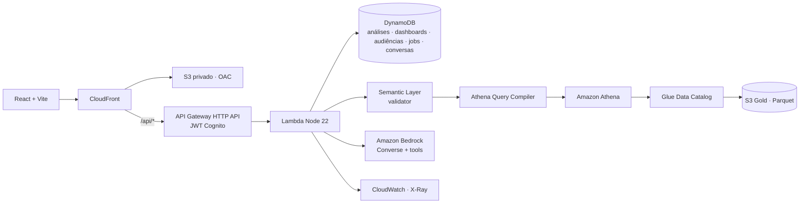

# BFP - PJ · Business Friendly Platform

> Todos os dados PJ em um só lugar, prontos para explorar, combinar e analisar.

O produto é um **playground analítico governado**: o negócio monta as próprias análises
combinando **métricas + dimensões + filtros + período + visualização**. Dashboards, audiências e
a Inteligência PJ são consequências da exploração — todos operam sobre o mesmo contrato,
`AnalysisSpec`.

```
EXPLORAR → ANALISAR → SALVAR → ORGANIZAR EM DASHBOARD → COMPARTILHAR → CRIAR AUDIÊNCIA → ATIVAR
```

## Arquitetura



Detalhes em [docs/aws-architecture.md](docs/aws-architecture.md). O documento
[docs/architecture.md](docs/architecture.md) é o discovery original (histórico; menciona o plano
Firebase abandonado — não há nenhuma dependência Firebase no código).

| Camada    | Implementação                                                                                                        |
| --------- | -------------------------------------------------------------------------------------------------------------------- |
| Frontend  | React 19, TypeScript, Vite, Tailwind v4 (tokens em `apps/web/src/app/styles.css`), TanStack Query, Zustand, Recharts |
| API       | Express empacotado para Lambda (`apps/api`), Zod, RBAC, logs estruturados                                            |
| Semântica | `packages/semantic-layer` — 24 métricas, 21 dimensões, 7 produtos de dados, glossário, linhagem                      |
| Motor     | `packages/analytics-engine` — engine local/DynamoDB, **AthenaQueryCompiler**, Insight Engine, Audience Engine        |
| IA        | Inteligência PJ: provedor determinístico local ou **Amazon Bedrock** (Converse + ferramentas governadas)             |
| Infra     | **AWS CDK** (`infra/`): Data, Auth, AI, Api, Web, Observability (+ GitHub OIDC opcional)                             |

## Pré-requisitos

- Node.js 22 (20+ funciona) e npm 10+
- Para AWS: AWS CLI v2 configurado e conta com CDK bootstrap (`npx cdk bootstrap`)

## Execução local

```bash
npm install
npm run seed          # gera data/dataset.json (determinístico, ~19 mil empresas sintéticas)
npm run dev           # web :5173 + api :3001 (proxy /api)
```

Abra http://localhost:5173. Em `AUTH_MODE=dev` os perfis de demonstração são:

| Pessoa        | E-mail                 | Time          | Papel    |
| ------------- | ---------------------- | ------------- | -------- |
| Mariana Souza | analyst@example.local  | Growth PJ     | analyst  |
| Camila Rocha  | admin@example.local    | Clientes PJ   | admin    |
| Rafael Lima   | business@example.local | Onboarding PJ | business |

Senha local: `demo-password-123` (somente `AUTH_MODE=dev`; nunca usada em nuvem).

O workspace de demonstração (análises, 6 dashboards, favoritos e audiências) é carregado em
memória ao subir a API. Desative com `SEED_DEMO_WORKSPACE=false`.

## Testes

```bash
npm run typecheck     # todos os workspaces + scripts
npm run lint          # eslint + prettier
npm run test          # unit + integração (packages, api, web, infra) + seed
npm run build
npm run test:e2e      # Playwright: 3 golden paths + Cliente 360 + capturas 1440×1024
npm run test:visual   # só as capturas em artifacts/screens/
```

## Deploy na AWS

Resumo (passo a passo em [docs/deployment.md](docs/deployment.md)):

```bash
npx cdk bootstrap aws://<ACCOUNT_ID>/sa-east-1
npm run build -w api && npm run build -w web
npm run deploy -w infra -- -c env=dev -c bedrockModelId=<MODEL_OR_INFERENCE_PROFILE_ID> \
  -c lakeFormationAdmins=<ARN_DO_OPERADOR> [-c datazoneDomainId=<dzd_...>]
# carga de dados e usuários (variáveis vêm dos outputs dos stacks)
npm run seed:aws        # DATASET_TABLE, AWS_REGION
npm run seed:lake       # DATA_LAKE_BUCKET, MESH_DATABASE_PREFIX, ATHENA_WORKGROUP, DATA_LOADED_AT_PARAMETER, AWS_REGION
npm run fullstory:export # opcional: eventos reais do FullStory → produto digital_journey
npm run seed:workspace  # OBJECTS_TABLE, AWS_REGION
npm run cognito:users   # COGNITO_USER_POOL_ID, DEMO_USER_PASSWORD, AWS_REGION
```

Ambientes independentes: `bfp-pj-dev`, `bfp-pj-homol`, `bfp-pj-prod`. Pipelines em
`.github/workflows/` (CI em PR; deploy em push para `homol`/`prod` via GitHub OIDC).

## Variáveis de ambiente (API)

| Variável                                                  | Uso                                                                       |
| --------------------------------------------------------- | ------------------------------------------------------------------------- |
| `AUTH_MODE`                                               | `dev` (JWT local HS256) ou `cognito`                                      |
| `COGNITO_USER_POOL_ID`, `COGNITO_CLIENT_ID`               | Cognito (modo `cognito`)                                                  |
| `DATASET_TABLE`, `OBJECTS_TABLE`                          | DynamoDB; vazio = repositórios em memória                                 |
| `ANALYTICS_ENGINE`                                        | `memory` · `dynamodb` · `athena`                                          |
| `ATHENA_DATABASE`, `ATHENA_WORKGROUP`                     | prefixo dos bancos do mesh e workgroup do Athena                          |
| `MESH_CATALOG`, `MESH_DATABASE_PREFIX`                    | catálogo do data mesh (`local` ou `glue`) e prefixo `bfp_pj_<env>`        |
| `DATAZONE_DOMAIN_ID`                                      | opcional: vincula listings do Amazon DataZone                             |
| `ATLAN_SECRET_ID` (ou `ATLAN_BASE_URL`/`ATLAN_API_TOKEN`) | Atlan, catálogo oficial                                                   |
| `FULLSTORY_SECRET_ID` (ou `FULLSTORY_API_KEY`)            | FullStory, jornada digital                                                |
| `DATA_LOADED_AT_PARAMETER`                                | parâmetro SSM com o horário da última carga (freshness)                   |
| `AI_PROVIDER`, `BEDROCK_MODEL_ID`                         | `local` (padrão) ou `bedrock`; o model id vem de env/SSM, nunca do código |
| `DATA_PATH`, `DATA_LOADED_AT`                             | dataset local e horário de carga exibido como freshness                   |
| `SEED_DEMO_WORKSPACE`                                     | carrega o workspace de demonstração no modo em memória                    |

## Estrutura

```text
apps/web            React (Explorar, Inteligência PJ, análises, dashboards, audiências, clientes, catálogo, governança, admin)
apps/api            API (rotas, serviços, engines, repositórios, IA)
packages/domain     contratos compartilhados (AnalysisSpec, audiências, jobs…)
packages/schemas    validação Zod
packages/semantic-layer  catálogo semântico, validator, linhagem, qualidade
packages/analytics-engine motores, compilador Athena, Insight Engine, Audience Engine
packages/shared     descritores de spec e operações (UPDATE_ANALYSIS)
scripts/seed        gerador sintético, cargas DynamoDB / Data Lake / workspace
infra               AWS CDK
e2e                 Playwright
docs                arquitetura, dados, semântica, motor, IA, segurança, deploy, roteiro de demo
```

## Documentação

- [Data mesh AWS, Atlan e FullStory](docs/data-mesh-and-integrations.md)

- [docs/aws-architecture.md](docs/aws-architecture.md)
- [docs/data-model.md](docs/data-model.md)
- [docs/semantic-layer.md](docs/semantic-layer.md)
- [docs/analytics-engine.md](docs/analytics-engine.md)
- [docs/ai-copilot.md](docs/ai-copilot.md)
- [docs/security.md](docs/security.md)
- [docs/deployment.md](docs/deployment.md)
- [docs/demo-script.md](docs/demo-script.md)
