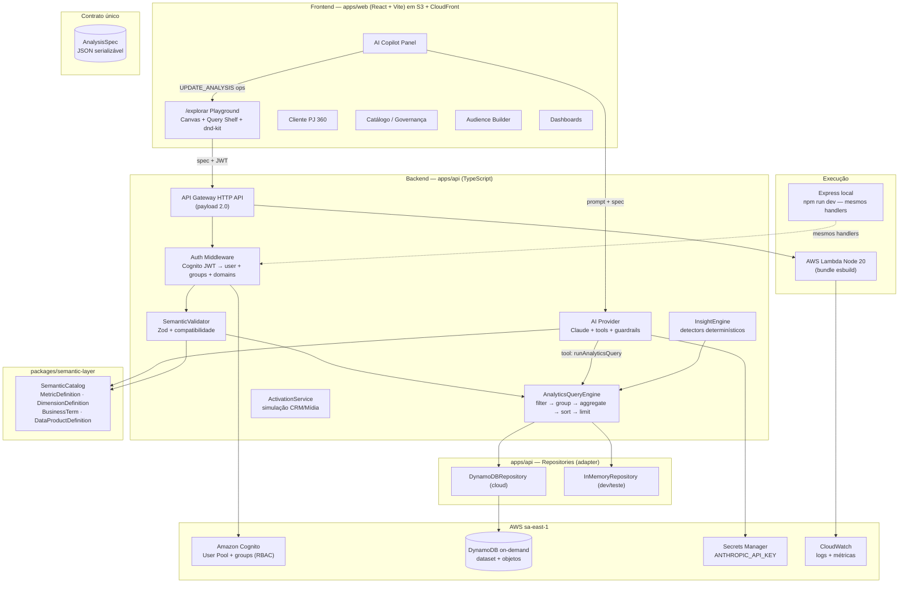
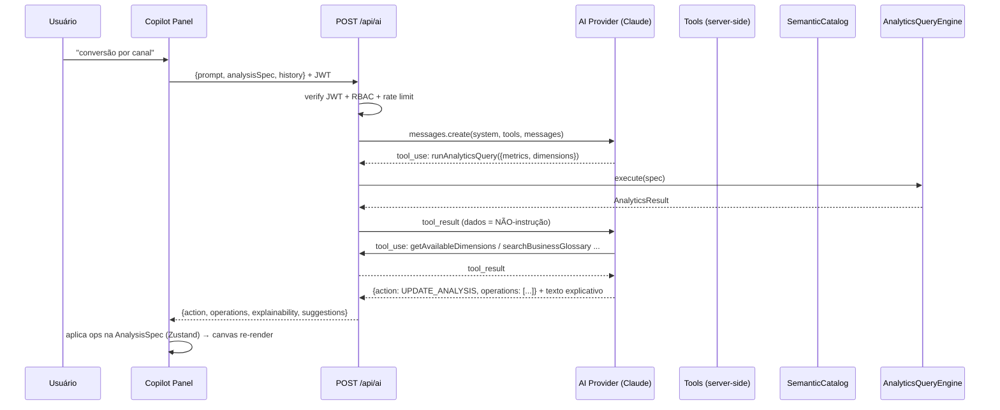

# FASE 0 — Discovery Técnico: BUSINESS FRIENDLY PLATFORM PJ (AWS edition)

> "Todos os dados PJ em um só lugar, prontos para explorar, combinar e analisar."

Este documento apresenta a arquitetura, decisões, riscos e plano de implementação do MVP.
É o gate de entrada da Fase 1. **Stack de infraestrutura: AWS** (decisão do usuário,
substituindo o plano original Firebase — a camada de aplicação/semântica não muda).

---

## 1. Arquitetura proposta

### 1.1 Princípio reitor

**O produto não entrega análises prontas. Entrega os blocos governados para que o negócio construa suas próprias análises.**

Toda análise é uma `AnalysisSpec` serializável. Frontend, IA, dashboards e persistência
manipulam o **mesmo objeto**. O backend nunca expõe endpoints especializados por pergunta
de negócio — apenas `POST /api/analytics/query` interpretado dinamicamente.

### 1.2 Visão geral



**Fluxo de dados (camada de produto):**

```
FONTES PJ → CAMADA DE DADOS (bronze/silver/gold conceitual) → CLIENTE PJ 360
→ CAMADA SEMÂNTICA → QUERY ENGINE → PLAYGROUND → INSIGHT → AUDIÊNCIA → ATIVAÇÃO
```

### 1.3 Regras arquiteturais inegociáveis

1. **Nenhum componente React acessa banco de dados.** Todo dado passa por
   `API Client → API Gateway → Lambda/Express → Auth → Semantic Validation → Engine → Repository`.
   O frontend não sequer empacota SDK de banco.
2. **Nenhum endpoint por pergunta de negócio.** Apenas endpoints genéricos
   (`/api/analytics/query`, `/api/catalog`, `/api/customers/:id`, `/api/audiences`, ...).
3. **Nenhuma métrica calculada em componente.** Componentes apenas formatam o que o
   motor retorna, usando `MetricDefinition.format`.
4. **A IA só enxerga o catálogo e o motor.** Nunca acesso livre a dados, nunca SQL.
5. **Código único backend:** os mesmos handlers rodam na Lambda (produção) e no
   servidor Express local (dev/testes) — adaptadores são a única diferença.
6. **Novo insight = nova `AnalysisSpec`, nunca novo código.**

---

## 2. Estrutura do monorepo

```
/
├── apps/
│   ├── web/                     # Vite + React + TS + Tailwind + shadcn/ui
│   │   └── src/
│   │       ├── app/             # router, providers, bootstrap
│   │       ├── components/      # ui/ (shadcn), layout/, shared/
│   │       ├── features/        # explorer/, catalog/, customer360/, audiences/, dashboards/, governance/
│   │       ├── pages/
│   │       ├── layouts/         # AppShell (sidebar + topbar)
│   │       ├── hooks/
│   │       ├── services/        # apiClient (fetch + JWT), auth service
│   │       ├── stores/          # zustand: explorer store, copilot store
│   │       ├── types/
│   │       └── utils/
│   │
│   └── api/                     # backend TypeScript (Node 20)
│       └── src/
│           ├── http/            # app.ts (Express), local.ts (dev server), lambda.ts (adapter)
│           ├── routes/          # rotas Express = superfície da API
│           ├── handlers/        # entrada fina da Lambda (delega para routes)
│           ├── auth/            # CognitoVerifier, DevTokenProvider, RBAC, domain access
│           ├── analytics/       # engine host, cache, auditoria
│           ├── ai/              # provider, tools, prompts, guardrails
│           ├── audiences/       # preview + activation jobs
│           ├── repositories/    # interfaces + DynamoDB + InMemory
│           ├── governance/      # catálogo, lineage, qualidade
│           ├── quality/         # quality engine + incidentes
│           └── common/          # logging, erros, config, zod helpers
│
├── packages/                    # compartilhado web ↔ api (ts paths + Vite alias + esbuild)
│   ├── domain/                  # entidades, enums, AnalysisSpec, AudienceDefinition
│   ├── semantic-layer/          # MetricDefinition, DimensionDefinition, SemanticCatalog, validator
│   ├── analytics-engine/        # filter/group/aggregate/sort + viz recommender
│   ├── shared/                  # formatadores, erros, contrato AnalyticsResult, log shape
│   └── schemas/                 # Zod schemas do contrato de API
│
├── infra/
│   └── template.yaml            # AWS SAM: HttpApi, Lambdas, DynamoDB, Cognito, S3+CloudFront, Secrets
│
├── scripts/seed/                # gerador determinístico (Faker seed fixo) + validação + seed:aws
├── e2e/                         # Playwright
├── docs/                        # este documento + demais
├── .env.example
├── package.json                 # npm workspaces: apps/*, packages/*
└── README.md
```

**Compartilhamento de código:** npm workspaces + tsconfig paths (`@bfp/*` → `packages/*/src`).
- **web**: resolve via alias no Vite (dev + build).
- **api local**: `tsx`/esbuild resolve os mesmos paths.
- **api Lambda**: bundle único via esbuild (SAM `BuildMethod: esbuild`) — pacotes workspace
  entram no bundle, nada de symlink fora do artefato. Deploy-safe.

---

## 3. Modelo de dados (DynamoDB)

### 3.1 Tabelas

| Tabela | PK | SK | GSI | Conteúdo |
|---|---|---|---|---|
| `bfp-{env}-dataset` | `ENTITY#<type>` | `<id>` | GSI1: `COMPANY#<companyId>` / `<timestamp>#<type>#<id>` (timeline) | entidades do dataset |
| `bfp-{env}-objects` | `USER#<uid>` | `<type>#<id>` | GSI1: `ID#<id>` / `USER#<uid>` (lookup/duplicar) | análises, dashboards, audiências, activationJobs |

`<type>` ∈ `company, partner, account, product, companyProduct, campaign, touchpoint,
funnelEvent, crmInteraction, conversation, digitalEvent, qualityStatus, auditLog`.

**Acesso:** sempre `Query` por partição (nunca `Scan`). Billing `PAY_PER_REQUEST`.

### 3.2 Volume alvo (seed determinístico)

| Entidade | Volume |
|---|---|
| companies | 1.500 |
| partners | ~4.500 |
| accounts | ~1.800 |
| products | 10 |
| companyProducts | ~4.000 |
| campaigns | ~40 |
| touchpoints | ~30.000 |
| funnelEvents | ~25.000 |
| crmInteractions | ~6.000 |
| conversations | ~4.000 |
| digitalEvents | ~40.000 |
| objects (análises etc.) | user-scoped |

### 3.3 Artefato de dados local

`npm run seed` gera **`data/dataset.json`** determinístico (Faker seed fixo) — fonte do
modo dev em memória, base dos testes e insumo de `npm run seed:aws` (batch write para o
DynamoDB do stage). Validação: `npm run seed:validate` imprime estatísticas e checa
coerência (relações intencionais de negócio, §13).

### 3.4 Entidades-chave (resumo)

```ts
// domínio: companies (grão principal da maioria das métricas)
Company {
  id, cnpjMasked, legalName, tradeName, segment, industry,
  companySize: 'MEI'|'Micro'|'Pequena'|'Média'|'Grande',
  state, city, region, employeeCountRange, annualRevenueRange,
  acquisitionSource, acquisitionChannel, acquisitionCampaignId,
  leadCreatedAt, accountOpeningStartedAt, accountOpenedAt,
  onboardingStartedAt, onboardingCompletedAt, activationDate,
  status: 'LEAD'|'ACCOUNT_OPENING'|'ONBOARDING'|'ACTIVE'|'INACTIVE',
  relationshipManagerId, lgpdConsent, riskProfile, createdAt
}
```

Demais entidades conforme especificação (Partner, Account, Product, CompanyProduct,
MediaCampaign, MediaTouchpoint, FunnelEvent, CRMInteraction, Conversation, DigitalEvent).

### 3.5 `Customer360` — composição, não tabela

Entidade lógica montada no backend via GSI1 (partição da empresa):
`Company + Partners + Accounts + CompanyProducts + Journey timeline unificada
(touchpoints ∪ funnelEvents ∪ crm ∪ conversations ∪ digitalEvents ordenados)`.

### 3.6 Catálogo semântico em código

`metrics/dimensions/glossary/dataProducts/lineage` vivem em `packages/semantic-layer`
(fonte da verdade versionada por PR) e são expostos pela API `/api/catalog`.
A tabela `objects` só guarda criação do usuário. *Decisão: governança por PR +
imutabilidade da demo; migração futura para tabela editável é trivial.*

---

## 4. AnalysisSpec — o contrato central

```ts
interface AnalysisSpec {
  id?: string;
  name?: string;
  metrics: MetricSelection[];        // { id, alias? }
  dimensions: DimensionSelection[];  // { id, granularity? } granularity: date|week|month
  filters: FilterCondition[];        // { field, operator, value? }
  dateRange?: DateRangeSpec;         // { type: LAST_N_DAYS|THIS_MONTH|CUSTOM|..., value?, from?, to? }
  comparison?: ComparisonSpec;       // { type: PREVIOUS_PERIOD | NONE }
  sorting?: SortSpec[];              // { field, direction }
  limit?: number;
  visualization: VisualizationSpec;  // { type: AUTO|TABLE|KPI|BAR|GROUPED_BAR|STACKED_BAR|LINE|AREA|DONUT|FUNNEL|SCATTER }
  metadata?: { createdBy?, createdAt?, updatedAt? };
}
```

- **Frontend edita** (drag, click, URL state).
- **Backend valida** (Zod + `SemanticValidator`).
- **Engine executa.**
- **Copilot modifica** (operações `ADD_METRIC`, `REMOVE_DIMENSION`, `SET_FILTER`, ...).
- **Persistência = este objeto.** **Dashboard = lista de referências a este objeto.**

Operadores: `EQ NEQ IN NOT_IN GT GTE LT LTE BETWEEN CONTAINS IS_NULL IS_NOT_NULL`
(compatibilidade por tipo do campo — a UI só oferece operadores válidos).

### Contrato de resultado

```ts
interface AnalyticsResult {
  columns: ColumnDef[];   // { key, label, type: metric|dimension, format?, role }
  rows: Record<string, unknown>[];
  metadata: {
    queryId, executionMs, rowCount,
    freshness, qualityScore,
    metricDefinitions: MetricDefinition[],   // para formatação/explicabilidade
    warnings?: string[]                      // ex.: "divisão por zero convertida em null"
  };
}
```

---

## 5. Camada semântica

### 5.1 Objetos

- `MetricDefinition`: id, name, shortName, description, businessDefinition, formula,
  aggregation (`SUM|COUNT|COUNT_DISTINCT|AVG|RATIO`), format (`number|currency|percent`), unit,
  domain, owner, source, timeField, allowedDimensions, allowedFilters,
  certificationStatus (`CERTIFIED|EXPERIMENTAL|DEPRECATED`), freshnessSLOMinutes,
  qualityThreshold, version, updatedAt, additivity (`ADDITIVE|NON_ADDITIVE`).
- `DimensionDefinition`: id, name, description, type (`string|number|date|boolean|enum`),
  domain, source, allowedOperators, sensitivity (`PUBLIC|INTERNAL|CONFIDENTIAL|PII`),
  certificationStatus.
- `BusinessTerm` (glossário), `DataProductDefinition` (produto de dados + SLO + quality + lineage).

### 5.2 `SemanticCatalog` (interface)

```ts
interface SemanticCatalog {
  getMetric(id): MetricDefinition | undefined;
  getDimension(id): DimensionDefinition | undefined;
  listMetrics(scope): MetricDefinition[];
  listDimensions(scope): DimensionDefinition[];
  validate(spec): SemanticValidation;   // { ok, errors: SemanticError[] }
  compatibility(metricId, dimensionId): boolean;
  resolveLineage(id): LineageGraph;
}
```

**Regras de compatibilidade:**
- `metric.allowedDimensions` = **allowlist** (lista explícita ou `*` menos dimensões proibidas).
- Métricas **não-aditivas** (`activation_d30_rate`, taxas) declaram `NON_ADDITIVE` — o engine
  recalcula a partir de agregados de base (numerator/denominator), nunca soma subtotais.
- Métricas **RATIO** declaram `numerator` e `denominator` (ids de métricas base) — computadas
  **no mesmo grain** e divididas com guard de zero (`null` + warning, nunca `Infinity`).
- Compatibilidade inválida → erro claro na UI: *"A métrica CAC não suporta a dimensão X."*

### 5.3 Métricas iniciais (23)

`companies_total, new_companies, leads, accounts_opened, account_conversion_rate,
media_spend, impressions, clicks, ctr, cpl, cac, onboarding_started,
onboarding_completed, onboarding_completion_rate, activation_d30, activation_d30_rate,
active_companies, products_per_company, average_opening_time, average_onboarding_time,
revenue_proxy, campaign_conversion_rate` + `unresolved_conversations` (apoio à narrativa).

---

## 6. AnalyticsQueryEngine

### 6.1 Interface

```ts
interface AnalyticsQueryEngine {
  execute(query: ValidatedAnalysisQuery): Promise<AnalyticsResult>;
}
```

Implementações MVP:
- **`DynamoDBAnalyticsQueryEngine`** (cloud): `Query` por partição com projeção das colunas
  necessárias (derivada do catálogo), normaliza, agrega em memória, retorna **somente agregados**.
- **`InMemoryAnalyticsQueryEngine`** (dev local/testes): mesma lógica sobre `data/dataset.json`.

Nunca envia dataset cru ao browser. Futura troca por `AthenaAnalyticsQueryEngine`/`BigQuery...`
sem alterar frontend (mesma interface).

### 6.2 Pipeline

```
ValidatedAnalysisQuery
  → resolveDateRange(dateRange) → janela [from, to)
  → loadDocuments(metrics ∪ dimensions ∪ filters, window)   (repository, cacheável)
  → applyFilters(filters + dateWindow)
  → groupBy(dimensions, granularity)                        (vazio = um único grupo)
  → aggregate(metrics)   ← RATIO: soma numerator e denominator por grupo, depois divide
  → applyComparison(PREVIOUS_PERIOD)  ← re-executa na janela anterior, anexa colunas
  → sort(sorting) → limit(limit)
  → applyVisualizationOrRecommend(shape)
  → AnalyticsResult (+ executionMs, queryId, freshness, qualityScore)
```

**Detalhes críticos:**
- Divisão por zero → `null` + warning (nunca `Infinity`/`NaN`).
- `COUNT_DISTINCT` calculado por grupo com `Set`.
- Date bucketing (`date|week|month`, semana ISO) com fuso `America/Sao_Paulo`.
- Cache: `SHA256(normalizedSpec + accessScope)` → TTL 60s em memória da instância.
- Auditoria: `queryId, userId, timestamp, metrics, dimensions, filters, executionMs, status`
  (gravada como `ENTITY#auditLog`).

### 6.3 VisualizationRecommendationEngine (puro, testável)

```
1 métrica, 0 dimensões            → KPI
1 métrica, 1 dim temporal          → LINE
1 métrica, 1 categórica (≤8 vals)  → BAR
1 métrica, 1 categórica (>8)       → BAR + limit 20 ordenado
2+ métricas, 1 categórica          → GROUPED_BAR
dimensões funil (eventType)        → FUNNEL
2 dimensões, 1 métrica             → STACKED_BAR
2 métricas, 0 dimensões            → KPI duplo
Tabela sempre disponível como fallback explícito
```

---

## 7. Arquitetura do Copilot



**Tools disponíveis (somente estas):**
`getAvailableMetrics, getAvailableDimensions, getMetricDefinition, getDimensionDefinition,
runAnalyticsQuery, getCustomer360, searchBusinessGlossary, createAudiencePreview,
getQualityStatus, getLineage`.

**Ações estruturadas:** `UPDATE_ANALYSIS (operations[])`, `ANSWER_QUESTION (tool, arguments)`,
`NONE`. Toda resposta numérica vem de `runAnalyticsQuery`; toda definição do catálogo.

**Guardrails:**
- Tool outputs marcados como dados não-confiáveis no system prompt (defesa contra prompt injection).
- Schema Zod valida toda `AnalysisSpec` gerada pela IA antes de aplicar.
- Sempre evidência → linguagem "Os dados sugerem...", nunca causalidade sem experimento.
- InsightEngine (detectors: period-over-period, maior contribuição, maior queda, outlier,
  share change) roda **antes** do LLM; Claude apenas narra evidência estruturada.
- Explicabilidade: cada resposta analítica inclui métrica/período/filtros/fonte/atualização
  + botão "Ver cálculo".
- `ANTHROPIC_API_KEY` lida da **Secrets Manager** apenas no runtime da Lambda.

---

## 8. Modelo de segurança

```
Browser ──(JWT Cognito — nunca userId do browser)──▶ API Gateway → Lambda/Express
    verifyJwt (aws-jwt-verify, RS256/JWKS em cloud · HS256 local em dev)
    → RBAC: groups admin | analyst | business
    → DomainAccess: papel × domínios das métricas/dimensões
    → Zod validation (body íntegro)
    → SemanticValidator (spec compatível)
    → Engine → Repository
```

- **Perfis (Cognito groups):** `ADMIN` (tudo) · `ANALYST` (explorar, salvar, dashboards,
  audiências) · `BUSINESS` (explorar, análises autorizadas, dashboards autorizados).
- **Domain access (config por papel):** Growth → `media, acquisition, customer360`;
  Produtos → `products, customer360`; Dados → amplo. Domínio não concedido é ocultado do
  catálogo **e** rejeitado no backend.
- **Modo dev local:** `AUTH_MODE=dev` → login `/api/auth/login` com usuários demo
  (`admin@example.local`, `analyst@example.local`, `business@example.local`) emite JWT
  HS256 com as MESMAS claims (groups). **Documentado como modo dev** — em cloud, o mesmo
  endpoint usa `InitiateAuth` (USER_PASSWORD_AUTH) no User Pool real.
- **Sem SDK de banco no frontend** — regra §1.3.1 torna vazamento impossível do lado client.
- **IAM least privilege** para a Lambda (apenas `dynamodb:Query/BatchWriteItem` nas tabelas,
  `secretsmanager:GetSecretValue` no segredo).
- **Secrets:** `ANTHROPIC_API_KEY` na Secrets Manager (referência no template, nunca em repo).
- **Google login:** via Cognito Identity Provider (IdP Google) — configurável por parâmetro;
  exige OAuth client do Google Cloud (setup documentado, default off no dev local).
- **Rate limiting:** por JWT+endpoint em memória da instância (100 req/min; IA 10/min) —
  limitação de instância documentada (upgrade: WAF/throttling no API Gateway).
- **Privacidade:** 100% dados sintéticos; sensibilidade aplicada mesmo assim; auditoria de
  query sem campos sensíveis.
- **Zod** em todo input; erros normalizados; logs estruturados
  (`correlationId, userId, operation, durationMs, status`) → CloudWatch.

---

## 9. Estratégia AWS

| Peça | Decisão |
|---|---|
| Frontend hosting | S3 privado (BlockPublicAccess all) + CloudFront com OAC; erros 403/404 → `/index.html` (200); `index.html` no-cache, `/assets/*` imutável |
| API | API Gateway **HTTP API** (payload 2.0) → **Lambda Node 20** (bundle esbuild via SAM), região `sa-east-1` |
| Auth | **Cognito User Pool** (email/senha; Google IdP opcional) + groups `admin/analyst/business`; JWT verificado com `aws-jwt-verify` |
| Dados | **DynamoDB** on-demand: `bfp-{env}-dataset` + `bfp-{env}-objects` |
| Segredos | **Secrets Manager** (`ANTHROPIC_API_KEY`) |
| Observabilidade | CloudWatch Logs (JSON estruturado) + métricas custom (queries, latência, erros, AI, activation jobs) |
| IaC | **AWS SAM** (`infra/template.yaml`) — ambientes dev/homolog/prod via parâmetros de stack |
| Dev local | `npm run dev` = Vite + servidor Express (`apps/api`) sobre `data/dataset.json` em memória + JWT dev — **offline, zero Docker** |
| Seed | `npm run seed` → `data/dataset.json` determinístico · `npm run seed:aws` → DynamoDB do stage (batch write) · `npm run seed:validate` → estatísticas |
| CI | GitHub Actions: install → typecheck → lint → test → build (PR); deploy com OIDC role / creds documentadas |
| Região | `sa-east-1` (padrão do CLI, parametrizável) |
| CLI tools | `aws` CLI v2 ✓ (instalado, conta 480595128032) · `sam` CLI (instalar via `brew install --cask aws-sam-cli` na Fase 1) |

Comandos alvo:

```bash
npm run dev                # web (5173) + api Express (3001) — offline
npm run seed               # gera data/dataset.json
npm run deploy:api         # sam build && sam deploy --config-env <env>
npm run deploy:web         # aws s3 sync + cloudfront invalidation
```

---

## 10. Riscos e mitigação

| # | Risco | Impacto | Mitigação |
|---|---|---|---|
| 1 | Engine DynamoDB carregar docs demais (eventos ~100k) | Latência/custo | `Query` por partição (nunca Scan) + projeção de colunas pelo catálogo + cache SHA256 60s + dataset pequeno; migração Athena/BigQuery documentada |
| 2 | Métricas não-aditivas/ratio erradas | Números incorretos | RATIO sobre agregados de base + guard de zero + testes de regressão com dados fixos |
| 3 | IA inventa IDs/números | Quebra de confiança | Tools fechados + Zod + `runAnalyticsQuery` obrigatório + guardrails |
| 4 | Ambição do briefing × prazo | Escopo | Fases estritas; gates por fase; nada de dashboards prontos |
| 5 | Compartilhar código web↔api↔Lambda | Build frágil | npm workspaces + ts paths + Vite alias + esbuild bundle (sem symlinks no artefato); typecheck no CI |
| 6 | shadcn/Tailwind v4 churn | Setup quebrado | Pin de versões verificado no npm na Fase 1; gates verdes |
| 7 | Dev local divergir de cloud | Bugs tardios | Mesmos handlers nos dois runtimes; apenas adaptadores (auth, repo) diferem; testes de contrato nas interfaces; engine 100% puro e testável sem AWS |
| 8 | dnd-kit acessibilidade | A11y | click-to-add paralelo sempre disponível |
| 9 | Vazamento de dados | Segurança | Frontend sem SDK de banco (by construction) + IAM least privilege + JWT obrigatório + Zod |
| 10 | Seed não-determinístico | Demo inconsistente | Faker seed fixo + `seed:validate` + artefato `data/dataset.json` |
| 11 | SAM CLI ausente / custos AWS | Bloqueio/custo | Instalar na Fase 1; recursos on-demand; custos só após `deploy` (dev local não gasta) |
| 12 | Cognito complexo (Google/retos) | Auth parcial | MVP: email/senha completo; Google via IdP documentado e parametrizável (default off no dev local) |

---

## 11. Plano de fases (resumo executivo)

| Fase | Entrega | Gate de qualidade |
|---|---|---|
| 0 | Este documento (AWS edition) | conclusão |
| 1 | Monorepo, Vite/React/TS/Tailwind/shadcn, **apps/api shell (Express + adapter Lambda)**, **infra/template.yaml (SAM)**, routing, lint, test, CI base | `install · typecheck · lint · test · build` verdes + `sam validate` |
| 2 | Domain model (packages/domain + schemas) + repositories (interfaces + InMemory + DynamoDB) | testes verdes |
| 3 | Seed determinístico 1.500 empresas → `data/dataset.json` + validação + estatísticas | `npm run seed` + `seed:validate` |
| 4 | Semantic layer + 23 métricas + dimensões + validador | testes de compatibilidade |
| 5 | Query Engine (filter/group/aggregate/sort/limit/dateRange/comparison) | testes multi-combinação |
| 6 | API routes (analyticsQuery, catalog, customer360, audiences, quality, ai, auth) | Zod + integração (supertest) |
| 7 | Explorer MVP (canvas vazio, pickers, filtros, período, tabela, bar, line, KPI) | golden path manual |
| 8 | Explorer avançado (dnd, multi, sorting, auto-viz, URL state, salvar) | critério §102 |
| 9 | Cliente PJ 360 + timeline | 2º golden path |
| 10 | Dashboard composer | composição do usuário |
| 11 | Audience Builder + preview + ativação simulada | §99 passos 18–21 |
| 12 | Catálogo, glossário, qualidade, lineage, data products, governança | busca "conversão" |
| 13 | AI Copilot (tools, guardrails, integração) | §99 passos 11–15 |
| 14 | Polish UX/estados/copy/a11y/responsivo | revisão visual |
| 15 | Hardening (RBAC, IAM, rate limits, logs, erros) | checklist segurança |
| 16 | E2E Playwright (2 golden paths) | verdes |
| 17 | **Deploy AWS (SAM + S3/CloudFront) + docs + roteiro de demo** | comandos documentados e executáveis |

Após **cada fase**: explicar → typecheck → lint → test → build → corrigir → avançar.

---

## 12. Teste arquitetural final (critério §102)

> *"Quero comparar CAC e ativação D30 por canal, porte e estado, nos últimos 120 dias."*

Deve resolver-se **apenas** montando:

```json
{
  "metrics": ["cac", "activation_d30_rate"],
  "dimensions": ["acquisition_channel", "company_size", "state"],
  "dateRange": { "type": "LAST_N_DAYS", "value": 120 },
  "visualization": { "type": "AUTO" }
}
```

Sem nova página, endpoint, componente, função de consulta ou código de backend.

---

## 13. Coerência dos dados sintéticos (narrativas obrigatórias)

O dataset deve produzir histórias úteis (validadas por `seed:validate`):

- **Google Search**: volume médio, boa conversão, CAC intermediário.
- **LinkedIn**: menor volume, CAC alto, empresas de maior porte, receita potencial maior.
- **Organic**: CAC muito baixo, boa conversão.
- **Meta**: alto volume, conversão inferior a Google Search.
- **Empresas médias**: maior número de produtos contratados.
- **Onboarding concluído em ≤3 dias**: maior chance de ativação D30.
- **>1 conversa não resolvida**: menor taxa de ativação.
