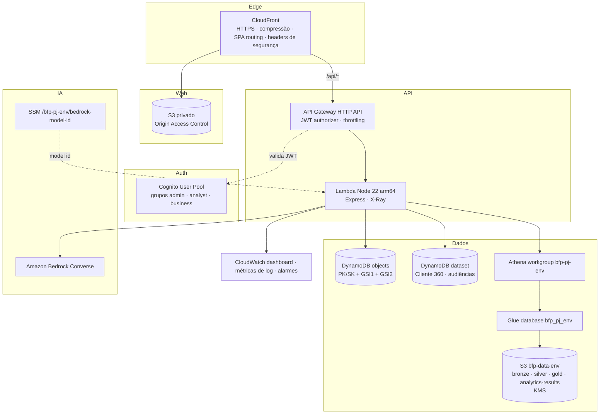

# Arquitetura AWS



## Stacks CDK (`infra/`)

| Stack                        | Recursos                                                                                                                                                                                                              |
| ---------------------------- | --------------------------------------------------------------------------------------------------------------------------------------------------------------------------------------------------------------------- |
| `bfp-pj-<env>-data`          | KMS (rotação), bucket do data lake (BLOCK_ALL, SSL, lifecycle de `analytics-results/`), Glue database, Athena workgroup (engine v3, limite de bytes, resultados cifrados), DynamoDB `dataset` e `objects` (PITR, KMS) |
| `bfp-pj-<env>-auth`          | User pool (sem self sign-up, e-mail, `custom:team`), grupos, app client sem secret                                                                                                                                    |
| `bfp-pj-<env>-ai`            | Parâmetro SSM com o model id do Bedrock (`NOT_CONFIGURED` = provedor local)                                                                                                                                           |
| `bfp-pj-<env>-api`           | Lambda + HTTP API, rotas públicas só para `POST /api/auth/login` e `GET /api/health`, IAM mínimo (tabelas, prefixos do bucket, workgroup, Glue, Bedrock, `ListUsersInGroup`)                                          |
| `bfp-pj-<env>-web`           | Bucket privado, CloudFront com OAC, `/api/*` → API (mesma origem), deploy do bundle Vite (assets imutáveis, `index.html` sem cache)                                                                                   |
| `bfp-pj-<env>-observability` | Dashboard (Lambda, API 4xx/5xx/latência, Athena, IA), métricas a partir dos logs estruturados, alarmes                                                                                                                |
| `bfp-pj-github-oidc`         | (opcional, `-c githubRepository=owner/repo`) provedor OIDC e role de deploy sem chaves estáticas                                                                                                                      |

## Data Lake

```
s3://bfp-data-<env>-<account>/
  bronze/{companies,media,crm,onboarding,products,conversations}/   NDJSON gzip (sem CNPJ, nomes ou texto livre)
  silver/{silver_companies,silver_media_events,silver_company_products,silver_interactions}/  NDJSON denormalizado
  gold/{customer_360,media,products,conversations}/                 Parquet (Snappy) via Athena CTAS
  analytics-results/                                                saída do Athena (expira em 7 dias)
```

Tabelas Gold no Glue: `gold_customer_360`, `gold_media`, `gold_products`, `gold_conversations`.
