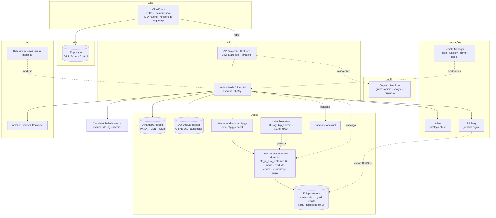

# Arquitetura AWS



## Stacks CDK (`infra/`)

| Stack                        | Recursos                                                                                                                                                                                                                                                                                                                                                                                                |
| ---------------------------- | ------------------------------------------------------------------------------------------------------------------------------------------------------------------------------------------------------------------------------------------------------------------------------------------------------------------------------------------------------------------------------------------------------- |
| `bfp-pj-<env>-data`          | KMS (rotação), bucket do data lake (BLOCK_ALL, SSL, lifecycle de resultados), **9 databases Glue (um por domínio do mesh)**, Lake Formation (admins, registro do bucket, LF-tags `bfp_domain`/`bfp_classification` associadas aos bancos), workgroups Athena da API e de ETL, DynamoDB `dataset` e `objects` (PITR, KMS), segredos Atlan/FullStory, parâmetro `data-loaded-at`                          |
| `bfp-pj-<env>-auth`          | User pool (sem self sign-up, e-mail, `custom:team`), grupos, app client sem secret                                                                                                                                                                                                                                                                                                                      |
| `bfp-pj-<env>-ai`            | Parâmetro SSM com o model id do Bedrock (`NOT_CONFIGURED` = provedor local)                                                                                                                                                                                                                                                                                                                             |
| `bfp-pj-<env>-api`           | Lambda + HTTP API, rotas públicas só para `POST /api/auth/login` e `GET /api/health`, IAM mínimo (tabelas, prefixos do bucket, workgroup, Glue dos bancos do mesh, `lakeformation:GetDataAccess`, segredos, SSM, Bedrock, `ListUsersInGroup`) e grants Lake Formation por LF-tag (`DESCRIBE` nos bancos, `SELECT`/`DESCRIBE` nas tabelas). O model id é lido do SSM no deploy (sem export entre stacks) |
| `bfp-pj-<env>-web`           | Bucket privado, CloudFront com OAC, `/api/*` → API (mesma origem), deploy do bundle Vite (assets imutáveis, `index.html` sem cache)                                                                                                                                                                                                                                                                     |
| `bfp-pj-<env>-observability` | Dashboard (Lambda, API 4xx/5xx/latência, Athena, IA), métricas a partir dos logs estruturados, alarmes                                                                                                                                                                                                                                                                                                  |
| `bfp-pj-github-oidc`         | (opcional, `-c githubRepository=owner/repo`) provedor OIDC e role de deploy sem chaves estáticas                                                                                                                                                                                                                                                                                                        |

## Data Lake (data mesh)

```
s3://bfp-data-<env>-<account>/
  bronze/{companies,media,crm,onboarding,products,conversations,fullstory}/  NDJSON gzip (sem CNPJ, nomes ou texto livre)
  silver/<domínio>/<tabela>/                                                NDJSON normalizado por produto de dados
  gold/<domínio>/<tabela>/                                                  Parquet (Snappy) via Athena CTAS
  analytics-results/   saída das consultas da API (expira em 7 dias)
  etl-results/         saída do workgroup de ETL (expira em 7 dias)
```

Produtos de dados (tabelas gold), todos com chave `company_id`:

| Banco Glue                  | Tabela              | Domínio                        |
| --------------------------- | ------------------- | ------------------------------ |
| `bfp_pj_<env>_customer360`  | `customer_360`      | Clientes PJ                    |
| `bfp_pj_<env>_media`        | `media_touchpoints` | Mídia PJ                       |
| `bfp_pj_<env>_products`     | `company_products`  | Produtos PJ                    |
| `bfp_pj_<env>_service`      | `conversations`     | Atendimento PJ                 |
| `bfp_pj_<env>_relationship` | `crm_interactions`  | Relacionamento PJ              |
| `bfp_pj_<env>_digital`      | `digital_journey`   | Canais Digitais PJ (FullStory) |
| `bfp_pj_<env>_app`          | `app_navigation`    | Canais Digitais PJ (app)       |
| `bfp_pj_<env>_payments`     | `transactions`      | Pagamentos PJ                  |
| `bfp_pj_<env>_experience`   | `nps_responses`     | Experiência do Cliente PJ      |

Detalhes de governança, seleção de bases e integrações em
[data-mesh-and-integrations.md](data-mesh-and-integrations.md).
