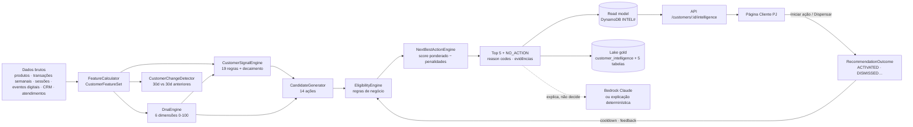

# Customer Intelligence · arquitetura

A página **Cliente PJ** (`/clientes/:companyId`) evoluiu de Customer 360 para
**Cliente PJ 360 + Customer DNA + Sinais + Próxima Melhor Ação (NBA)**. Continua sendo uma única
página: o cabeçalho e as abas de 360 ganharam o DNA, os sinais, o que mudou e a recomendação.

## Pipeline

`DATA → CUSTOMER 360 → FEATURES → SIGNALS → DNA → CANDIDATE ACTIONS → ELIGIBILITY → RANKING → NBA →
ACTIVATION → OUTCOME → FEEDBACK`.

O cálculo inteiro é **determinístico** e vive em `packages/customer-intelligence` (sem I/O):

| Módulo           | Responsabilidade                                                                                      |
| ---------------- | ----------------------------------------------------------------------------------------------------- |
| `features.ts`    | `computeFeatures(raw, asOf)`: janelas de 14 a 90 dias; ignora dados posteriores ao as-of              |
| `dna.ts`         | `computeDna`: 6 dimensões com drivers, nível e tendência (vs. 30 dias atrás) — `DnaScoringConfig`     |
| `signals.ts`     | `detectSignals`: 19 regras com `detectedAt`, `expiresAt`, evidências e decaimento (meia-vida 21 dias) |
| `changes.ts`     | `detectChanges`: variações relevantes (volume, acessos, conteúdo de crédito, cartão, pagamentos, CRM) |
| `actions.ts`     | catálogo de 14 ações (inclui `NO_ACTION`), afinidade com o DNA e impacto esperado                     |
| `eligibility.ts` | `checkEligibility`: produto já contratado, status, consentimento, cooldown, reclamação, jornada…      |
| `nba.ts`         | candidatos → elegibilidade → score → ranking; `NO_ACTION`; gate `INSUFFICIENT_DATA`                   |
| `explanation.ts` | explicação estruturada (usada localmente e como fallback da IA)                                       |
| `similarity.ts`  | distância normalizada (DNA 70%, porte 15%, segmento 10%, região 5%), limiar 0,2                       |
| `cluster.ts`     | `ClusterDNA`: agrega as NBAs individuais de um grupo (nunca uma NBA "do grupo")                       |
| `pipeline.ts`    | `buildCustomerProfile(s)`: roda tudo em `asOf` e `asOf − 30d` (tendência, leitura e impacto)          |

## Papel da IA

A LLM **não é o motor de decisão**. Ação, elegibilidade, score, ranking e `actionId` vêm do
`NextBestActionEngine`. O Claude (Amazon Bedrock) apenas:

- explica uma recomendação (`POST /api/recommendations/:id/explain`): recebe só o JSON estruturado
  (reason codes, evidências, componentes, alternativas), devolve resumo, "por que agora", explicação,
  sugestão de conversa e perguntas e respostas. Frases com números que não estão na entrada são
  descartadas (`isGrounded`);
- responde perguntas sobre o cliente na Inteligência PJ, chamando as ferramentas
  `getCustomerDNA`, `getCustomerSignals`, `getCustomerChanges`, `getNextBestActions`,
  `explainRecommendation` e `findSimilarCustomers` (somente leitura do perfil materializado).

Interfaces: `AIExplanationProvider` com `BedrockExplanationProvider` e
`DeterministicExplanationProvider`. Sem Bedrock (desenvolvimento local, modelo não liberado) a
resposta é a explicação estruturada, **rotulada como tal** ("Explicação estruturada (sem IA
generativa)"). Nunca se finge que o Claude respondeu.

## Read model e APIs

O perfil completo (~20 KB) e um resumo compacto por cliente ficam na tabela de dataset existente
(single-table), em partições próprias:

| PK                           | SK                                  | Conteúdo                                   |
| ---------------------------- | ----------------------------------- | ------------------------------------------ |
| `INTEL#PROFILE`              | `customerId`                        | `CustomerIntelligenceProfile` completo     |
| `INTEL#SUMMARY`              | `customerId`                        | DNA, ação #1, sinais (clusters/semelhança) |
| `INTEL#OUTCOME#<customerId>` | `timestamp#recommendationId#status` | `RecommendationOutcome`                    |

Repositórios: `CustomerIntelligenceRepository` e `RecommendationOutcomeRepository`
(InMemory para desenvolvimento local, DynamoDB na nuvem).

| Método | Rota                                 | Uso                                                |
| ------ | ------------------------------------ | -------------------------------------------------- |
| GET    | `/api/customers/:id/intelligence`    | tudo que a página precisa (perfil + outcomes)      |
| GET    | `/api/customers/:id/dna`             | DNA                                                |
| GET    | `/api/customers/:id/signals`         | sinais                                             |
| GET    | `/api/customers/:id/recommendations` | ranking e versão do modelo                         |
| POST   | `/api/recommendations/:id/outcomes`  | `ACTIVATED`, `DISMISSED`, `ACCEPTED`, `CONVERTED`… |
| POST   | `/api/recommendations/:id/explain`   | explicação (IA ou estruturada)                     |
| POST   | `/api/clusters/intelligence`         | `ClusterDNA` por lista de clientes ou filtros      |
| POST   | `/api/audiences/intelligence`        | `ClusterDNA` do público do Audience Builder        |
| POST   | `/api/customers/similar`             | clientes semelhantes + DNA do grupo                |
| POST   | `/api/ai/chat` com `customerId`      | perguntas sobre o cliente na Inteligência PJ       |

## Camada semântica e lake

`npm run intelligence:rebuild` publica uma linha por empresa em `dataset.json`
(`customerIntelligence`), carregada como o produto de dados do mesh **`customer_intelligence`**
(Glue `bfp_pj_<env>_intelligence`). Métricas certificadas: `intelligence_customers`,
`avg_nba_score` e `dna_*_score` (6). Dimensões: `nba_action`, `dna_commercial_intent_level`,
`dna_digital_engagement_level`. É isso que o botão **Explorar empresas semelhantes** abre no
Playground (filtrado por porte e segmento, separado pela ação #1).

`npm run seed:intelligence` também publica as tabelas gold auxiliares no mesmo banco:
`customer_features`, `customer_dna`, `customer_signals`, `nba_recommendations` e `nba_outcomes`.

## Execução

| Ambiente | Como roda                                                                                                                                                                                                   |
| -------- | ----------------------------------------------------------------------------------------------------------------------------------------------------------------------------------------------------------- |
| Local    | `npm run intelligence:rebuild` grava `data/customer-intelligence.json` (lido pela API em memória) e o snapshot em `data/dataset.json`. Funciona sem AWS.                                                    |
| AWS      | `npm run seed:intelligence` (DATASET_TABLE, DATA_LAKE_BUCKET, MESH_DATABASE_PREFIX, ATHENA_WORKGROUP): perfis no DynamoDB, dados brutos em `s3://<lake>/intelligence/raw/customers.json.gz` e tabelas gold. |
| Diário   | Regra EventBridge `bfp-pj-<env>-intelligence-rebuild` (06:00 UTC) → Lambda `…-intelligence-rebuild` (mesmo pacote, handler `intelligenceRebuildHandler`, 15 min, 3 GB).                                     |

## Observabilidade e governança

- Logs estruturados: `DNA_CALCULATED`, `SIGNAL_DETECTED`, `NBA_GENERATED`, `NBA_VIEWED`,
  `NBA_ACTIVATED`, `NBA_DISMISSED`, `NBA_OUTCOME`.
- Métricas CloudWatch (Embedded Metric Format, namespace `BFP/Intelligence`):
  `CustomersProcessed`, `SignalsDetected`, `NoActionCustomers`, `RebuildDurationMs`.
- Versionamento: `dnaVersion` (`dna-1.0.0`) e `modelVersion` (`nba-1.0.0`) em cada perfil,
  recomendação, snapshot e tabela.
- Quality gate: qualidade dos dados < 0,4 → somente `NO_ACTION` (reason code `INSUFFICIENT_DATA`);
  < 0,7 reduz a confiança. A freshness exibida é a do cálculo (`updatedAt`), não um texto fixo.
- Nenhum atributo pessoal sensível ou protegido entra em features, DNA ou NBA; o lake não recebe
  CNPJ, nomes ou texto livre. O DNA é leitura comportamental, **não é nota de crédito**.

Ver também: [customer-dna.md](customer-dna.md), [signals.md](signals.md),
[next-best-action.md](next-best-action.md), [nba-scoring.md](nba-scoring.md) e
[synthetic-data.md](synthetic-data.md).
