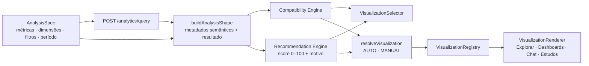

# Motor de visualização

O Explorar, os dashboards, as respostas da Inteligência PJ e os estudos desenham qualquer análise
pelo mesmo motor. Uma nova pergunta de negócio nunca exige um gráfico novo: o gráfico recebe o
resultado governado (`POST /analytics/query`), a `VisualizationSpec` e os metadados semânticos.



## Peças

| Peça                      | Onde                                                                                                | O que faz                                                                                                                                                                                      |
| ------------------------- | --------------------------------------------------------------------------------------------------- | ---------------------------------------------------------------------------------------------------------------------------------------------------------------------------------------------- |
| Catálogo de visualizações | `packages/shared/src/visualization/catalog.ts`                                                      | Nome, descrição, categoria e requisito de cada tipo; converte tipos antigos (`BAR` → `BAR_HORIZONTAL`, `GROUPED_BAR` → `COLUMN_GROUPED`, `STACKED_BAR` → `COLUMN_STACKED`)                     |
| Compatibility Engine      | `packages/shared/src/visualization/engine.ts` (`checkVisualizationCompatibility`)                   | `{ compatible, reason, requirements }` por tipo, com o que falta em linguagem de negócio                                                                                                       |
| Recommendation Engine     | idem (`evaluateVisualizations`, `recommendVisualizations`)                                          | Score 0–100 e motivo por tipo; Top 3 para a análise                                                                                                                                            |
| Resolução AUTO/MANUAL     | idem (`resolveVisualization`)                                                                       | Escolhe o gráfico desenhado e informa quando um gráfico fixado deixou de servir                                                                                                                |
| Metadados semânticos      | `packages/semantic-layer/src/catalog.ts` (`METRIC_SEMANTICS`, `DIMENSION_SEMANTICS`)                | `semanticType`, `funnelStage`, `cohortRole`, `geoLevel`; o restante é inferido (formato, agregação, aditividade)                                                                               |
| VisualizationRegistry     | `apps/web/src/features/viz/registry.tsx`                                                            | Fonte única de ícone, opções do painel e renderer de cada tipo                                                                                                                                 |
| VisualizationRenderer     | `apps/web/src/features/viz/visualization-renderer.tsx`                                              | Desenha qualquer análise; estados vazio, sem dados, incompatível e resumo acessível                                                                                                            |
| VisualizationSelector     | `apps/web/src/features/viz/visualization-selector.tsx`                                              | Seletor único: busca, Automático, recomendadas com motivo, categorias e incompatíveis desabilitados com o requisito                                                                            |
| Painel de opções          | `apps/web/src/features/viz/visualization-settings.tsx`                                              | Só as opções do tipo selecionado; salvas em `visualization.settings`                                                                                                                           |
| Camada de transformação   | `apps/web/src/features/viz/transforms.ts`                                                           | Faixas (histograma), quartis (box plot), coorte (início × meses decorridos), contribuições (cascata), fluxos (Sankey), etapas (funil), dias (calendário) — tudo derivado do resultado genérico |
| Adapters                  | `series-chart`, `composition-charts`, `relation-charts`, `time-geo-charts`, `heatmap`, `data-table` | Escondem a biblioteca (Recharts) e componentes próprios; o Explorar não conhece Recharts                                                                                                       |

## VisualizationSpec

```ts
interface VisualizationSpec {
  type: VisualizationType;          // AUTO ou um dos tipos da matriz
  mode?: 'AUTO' | 'MANUAL';         // ausente = AUTO quando type é AUTO
  settings?: { sort, topN, showValues, showLegend, showGrid, showTable, showPoints, smooth,
               showPercent, trendLine, xAxis, yAxis, size, bins, innerRadius, conditional, … };
}
```

É salva dentro da `AnalysisSpec`: ao reabrir a análise, o mesmo gráfico, as mesmas opções e o mesmo
modo voltam. Os dashboards usam a `VisualizationSpec` da análise e o mesmo `VisualizationRenderer`.

## Modo AUTO e MANUAL

- **AUTO**: a plataforma desenha o gráfico de maior score e o seletor mostra
  `Automático · <gráfico>`. Quando a análise muda, a escolha muda junto (ex.: Conversão → Indicador;
  \+ Canal → Barras horizontais; \+ Porte → Mapa de calor; \+ Mês → Tabela).
- **MANUAL**: escolher um tipo fixa o gráfico. Adicionar ou remover dimensões não troca o gráfico.
  Se ele ficar incompatível, a tela avisa “não é compatível com a análise atual”, explica o
  requisito, desenha o recomendado e oferece **Usar visualização recomendada**.
- Escolher **Automático** devolve a decisão à plataforma.

## Recomendação (exemplos de regras)

| Análise                                        | 1ª recomendação          | Motivo                                 |
| ---------------------------------------------- | ------------------------ | -------------------------------------- |
| 1 métrica, sem dimensão                        | Indicador (Tabela em 2º) | Destaca o valor                        |
| 1 métrica × 1 categoria com 6+ valores         | Barras horizontais       | Comparar muitos valores e nomes longos |
| 1 métrica × 1 categoria com até 6 valores      | Colunas                  | Poucas categorias lado a lado          |
| métrica × tempo                                | Linha                    | Evolução                               |
| métrica × tempo × categoria (até 6)            | Múltiplas linhas         | Uma linha por série                    |
| 1 métrica × 2 categorias                       | Mapa de calor            | Cruzamento                             |
| 2 métricas em unidades diferentes × categoria  | Dispersão                | Relação entre métricas                 |
| 3 métricas × categoria                         | Bolhas                   | X, Y e tamanho                         |
| métricas de etapas (`funnelStage`)             | Funil                    | Queda entre etapas                     |
| data de início × data de evento (`cohortRole`) | Cohort                   | Coortes por meses decorridos           |
| origem (`SOURCE`) × destino (`DESTINATION`)    | Sankey (disponível)      | Fluxos                                 |
| dimensão geográfica (`GEO`)                    | Mapa (disponível)        | Brasil por UF/região                   |

Empilhados, rosca, treemap, cascata e Sankey só aparecem para métricas aditivas (contagens,
valores); taxas e médias recebem o motivo da incompatibilidade.

## Matriz de requisitos

| Visualização            | Tipo                 | Categoria                | Requisitos (métricas · dimensões · semântica)                                 |
| ----------------------- | -------------------- | ------------------------ | ----------------------------------------------------------------------------- |
| Indicador               | `KPI`                | Básico                   | Remova as dimensões para ver só os indicadores.                               |
| Tabela                  | `TABLE`              | Básico                   | Adicione uma métrica.                                                         |
| Barras horizontais      | `BAR_HORIZONTAL`     | Comparação               | Adicione uma dimensão para comparar.                                          |
| Colunas                 | `COLUMN`             | Comparação               | Adicione uma dimensão para comparar.                                          |
| Barras agrupadas        | `BAR_GROUPED`        | Comparação               | Use 2 a 4 métricas com 1 dimensão, ou 1 métrica com 2 dimensões.              |
| Colunas agrupadas       | `COLUMN_GROUPED`     | Comparação               | Use 2 a 4 métricas com 1 dimensão, ou 1 métrica com 2 dimensões.              |
| Barras empilhadas       | `BAR_STACKED`        | Composição               | Use uma métrica que soma (contagem, valor) com 2 dimensões.                   |
| Colunas empilhadas      | `COLUMN_STACKED`     | Composição               | Use uma métrica que soma (contagem, valor) com 2 dimensões.                   |
| Barras 100% empilhadas  | `BAR_100_STACKED`    | Composição               | Use uma métrica que soma (contagem, valor) com 2 dimensões.                   |
| Colunas 100% empilhadas | `COLUMN_100_STACKED` | Composição               | Use uma métrica que soma (contagem, valor) com 2 dimensões.                   |
| Rosca                   | `DONUT`              | Composição               | Use 1 métrica que soma com 1 dimensão de até 8 categorias.                    |
| Treemap                 | `TREEMAP`            | Composição               | Use 1 métrica que soma com 1 ou 2 dimensões.                                  |
| Linha                   | `LINE`               | Tendência                | Adicione uma dimensão de tempo (ex.: Mês).                                    |
| Múltiplas linhas        | `MULTI_LINE`         | Tendência                | Use tempo com uma segunda dimensão ou com 2+ métricas.                        |
| Área                    | `AREA`               | Tendência                | Adicione uma dimensão de tempo (ex.: Mês).                                    |
| Área empilhada          | `AREA_STACKED`       | Tendência                | Use tempo, uma métrica que soma e uma segunda dimensão.                       |
| Histograma              | `HISTOGRAM`          | Distribuição             | Use 1 métrica com 1 dimensão de muitas categorias.                            |
| Box plot                | `BOX_PLOT`           | Distribuição             | Use 1 métrica com 1 ou 2 dimensões (vários valores por grupo).                |
| Dispersão               | `SCATTER`            | Relação                  | Adicione duas métricas numéricas e uma dimensão.                              |
| Bolhas                  | `BUBBLE`             | Relação                  | Adicione três métricas numéricas e uma dimensão.                              |
| Quadrantes              | `QUADRANT`           | Relação                  | Adicione duas métricas numéricas e uma dimensão.                              |
| Funil                   | `FUNNEL`             | Jornada                  | Use métricas de etapas da jornada (ex.: Leads, Contas abertas, Ativações).    |
| Sankey                  | `SANKEY`             | Jornada                  | Adicione uma dimensão de origem (ex.: Canal) e uma de destino (ex.: Produto). |
| Timeline                | `TIMELINE`           | Jornada                  | Use uma data diária e uma dimensão de tipo de evento.                         |
| Mapa de calor           | `HEATMAP`            | Análise multidimensional | Use 1 métrica com 2 dimensões.                                                |
| Cohort                  | `COHORT`             | Análise multidimensional | Use uma data de início (ex.: Abertura) e uma data de evento (ex.: Ativação).  |
| Curva de retenção       | `RETENTION_CURVE`    | Análise multidimensional | Use uma data de início (ex.: Abertura) e uma data de evento (ex.: Ativação).  |
| Radar                   | `RADAR`              | Análise multidimensional | Use 3+ métricas na mesma escala (ex.: scores do DNA).                         |
| Mapa                    | `MAP`                | Geografia                | Adicione Estado ou Região para usar o mapa.                                   |
| Calendário              | `CALENDAR_HEATMAP`   | Especializados           | Use 1 métrica com uma data diária.                                            |
| Cascata                 | `WATERFALL`          | Especializados           | Use 1 métrica que soma com 1 dimensão.                                        |
| Ranking                 | `RANKING`            | Especializados           | Use 1 métrica com 1 dimensão.                                                 |

## Mapa

Mapa do Brasil em formato de grade (cartograma): cada UF é um quadrado na sua posição geográfica,
colorido pela métrica, sem GeoJSON externo nem serviço pago. Com Região, cada UF recebe o valor da
sua região.

## Inteligência PJ

- `SET_VISUALIZATION` aceita todos os tipos (também como `visualizationType`). Pedidos como
  “mostre isso em linha” trocam o gráfico; um pedido incompatível (“compare em um mapa” sem
  Estado/Região) é explicado com o requisito, sem aplicar.
- Ferramenta `recommendVisualization`: “qual gráfico faz mais sentido?” responde com o mesmo motor.
- Respostas e estudos usam o `VisualizationRenderer`; no chat o seletor é compacto e permite trocar
  o gráfico da resposta. Os capítulos dos estudos usam o gráfico recomendado para o resultado.

## Telemetria

`POST /api/telemetry` (lista fechada de eventos, sem PII nem texto livre):
`VISUALIZATION_DROPDOWN_OPENED`, `VISUALIZATION_SELECTED`, `AUTO_VISUALIZATION_SELECTED`,
`VISUALIZATION_RECOMMENDATION_ACCEPTED` e `VISUALIZATION_INCOMPATIBLE_ATTEMPT`, com o formato da
análise (tipos semânticos e quantidade de categorias), tipo anterior, tipo novo, modo e superfície.

## Como adicionar um tipo

1. `VISUALIZATION_TYPES` (domain) e o schema.
2. Metadados e regra em `packages/shared/src/visualization` (catálogo + `RULES`), com teste.
3. Renderer genérico e entrada no `VisualizationRegistry` (ícone, opções).
4. Caso de teste visual em `e2e/visual-charts.spec.ts`.

## Testes

- `packages/shared/src/visualization/engine.test.ts`: os 10 casos do motor e AUTO/MANUAL.
- `e2e/golden-visualization.spec.ts`: golden paths (AUTO/MANUAL, dispersão → bolhas, mapa, funil,
  requisitos dos incompatíveis).
- `e2e/visual-charts.spec.ts`: 30 capturas 1440 × 1024 (uma por tipo) em `artifacts/charts`.
